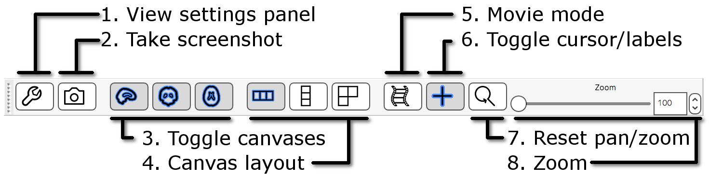

:::::::::::::::::::::::::::::::::::::: questions 

- How is imaging data represented in a computer?
- What are some of the popular imaging formats used?
- How do I view and navigate around an image/

::::::::::::::::::::::::::::::::::::::::::::::::

::::::::::::::::::::::::::::::::::::: objectives

- Describe the structure of imaging data
- Understand the coordinate systems and mapping between voxels and real world. 
- Demonstrate how to view images, navigate through volumes and change contrast
::::::::::::::::::::::::::::::::::::::::::::::::

## Introduction
Any medical image consists of two parts: a **header** and the **image** itself. 
The header consists of metadata that describe the image. This includes the 
patient’s demographic information such as the patient’s name, age, gender, and
date of birth. The header also gives information on the image characteristics 
such as image dimension and some acquisition parameters. Because of the need 
to store more information, medical images require specific formats 
(different from e.g. .jpeg or .png).

### Image formats: DICOM and NIfTI
**DICOM (.dcm)** stands for Digital Imaging and Communications in Medicine. It 
is a standard, internationally accepted format to view, store, retrieve and 
share medical images. Clinical imaging data are typically stored and 
transferred in the DICOM format, so DICOM can be considered the native format 
in which we get imaging data from the scanner.

**NIfTI (.nii, .nii.gz)** format is simpler and easier to support, so has been
widely adopted by scientists in the neuroimaging community. Therefore, a vital
initial step in processing the data is to convert images from DICOM to NIfTI 
format. In this practical we will work with data that have already been 
converted to NIfTI, but many tools for such conversions are available (for 
example [dcm2niix](https://www.nitrc.org/plugins/mwiki/index.php/dcm2nii:MainPage)).

:::::::::::::::::::::: discussion
If you are interested in trying out converting DICOM data to Nifti, we have some 
sample DICOM data for you. Please see the [bonus exercise](#bonus-exercise-dicom-to-nifti) at the end of this lesson
if you would like to give this a go.
::::::::::::::::::::::

### Viewing image properties - fslhd and fslinfo
These tools enable various properties of an image to be viewed.

Clicking on the Applications in the upper left-hand corner and select the 
terminal icon. This will open a terminal window that you will use to type 
commands
{alt="Launch terminal window"}

From the terminal window type:

```bash
cd ~/data/ImageDataVisualization
ls
```
```output
sub-OAS30015_acq-TSE_T2w.json            sub-OAS30015_T1w_brain_seg.nii.gz
sub-OAS30015_acq-TSE_T2w.nii.gz          sub-OAS30015_T1w.json
sub-OAS30015_T1w_brain_mask.nii.gz       sub-OAS30015_T1w.nii.gz
sub-OAS30015_T1w_brain_mixeltype.nii.gz  sub-OAS30015_T1w_orig.nii.gz
sub-OAS30015_T1w_brain.nii.gz            sub-OAS30015_T2star.json
sub-OAS30015_T1w_brain_pve_0.nii.gz      sub-OAS30015_T2star.nii.gz
sub-OAS30015_T1w_brain_pve_1.nii.gz      sub-OAS30015_T2w.json
sub-OAS30015_T1w_brain_pve_2.nii.gz      sub-OAS30015_T2w.nii.gz
sub-OAS30015_T1w_brain_pveseg.nii.gz
```

This means that we are going to be working in the `ImageDataVisualization` 
subfolder under `data` in your home directory (`~`).
The `ls` command gives you a list of the files in this directory.

:::::::::::::::::::: spoiler
## Need help?
If you are in general unfamiliar with how to use the command line, then we suggest you glance
over this [[additional tutorial]](./command-line.md).

If you are not sure how to use a command, there are multiple ways of getting help:

- **Using the man command** Just type `man` in front of it to get the *manual entry*.

    ```bash
    man ls
    man find
    man more
    man less
    ```
- **Use the -h option** Many commands will provide more information about how to use
a command if you type `-h` or `--help` after the command. This usually produces the
*usage statement*. Let's take a look at what happens when we want to get more help
with the `dcm12niix` command mentioned above to convert a DICOM file set to a Nifti.

    ```bash
    dcm2niix -h
    ```

    ```output
    Chris Rorden's dcm2niiX version v1.0.20240202  Clang14.0.0 x86-64 (64-bit MacOS)
    usage: dcm2niix [options] <in_folder>
     Options :
      -1..-9 : gz compression level (1=fastest..9=smallest, default 6)
      -a : adjacent DICOMs (images from same series always in same folder) for faster conversion (n/y, default n)
      -b : BIDS sidecar (y/n/o [o=only: no NIfTI], default y)
      -ba : anonymize BIDS (y/n, default y)
      -c : comment stored in NIfTI aux_file (up to 24 characters e.g. '-c VIP', empty to anonymize e.g. 0020,4000 e.g. '-c ""')
      -d : directory search depth. Convert DICOMs in sub-folders of in_folder? (0..9, default 5)
      -e : export as NRRD (y) or MGH (o) or JSON/JNIfTI (j) or BJNIfTI (b) instead of NIfTI (y/n/o/j/b, default n)
      -f : filename (%a=antenna (coil) name, %b=basename, %c=comments, %d=description, %e=echo number, %f=folder name, %g=accession number, %i=ID of patient, %j=seriesInstanceUID, %k=studyInstanceUID, %m=manufacturer, %n=name of patient, %o=mediaObjectInstanceUID, %p=protocol, %r=instance number, %s=series number, %t=time, %u=acquisition number, %v=vendor, %x=study ID; %z=sequence name; default '%i_%s_%d')
      -g : generate defaults file (y/n/o/i [o=only: reset and write defaults; i=ignore: reset defaults], default n)
      -h : show help
      -i : ignore derived, localizer and 2D images (y/n, default n)
      -l : losslessly scale 16-bit integers to use dynamic range (y/n/o [yes=scale, no=no, but uint16->int16, o=original], default o)
      -m : merge 2D slices from same series regardless of echo, exposure, etc. (n/y or 0/1/2, default 2) [no, yes, auto]
      -n : only convert this series CRC number - can be used up to 16 times (default convert all)
      -o : output directory (omit to save to input folder)
      -p : Philips precise float (not display) scaling (y/n, default y)
      -q : only search directory for DICOMs (y/l/n, default y) [y=show number of DICOMs found, l=additionally list DICOMs found, n=no]
      -r : rename instead of convert DICOMs (y/n, default n)
      -s : single file mode, do not convert other images in folder (y/n, default n)
      -u : up-to-date check
      -v : verbose (n/y or 0/1/2, default 0) [no, yes, logorrheic]
      -w : write behavior for name conflicts (0,1,2, default 2: 0=skip duplicates, 1=overwrite, 2=add suffix)
      -x : crop 3D acquisitions (y/n/i, default n, use 'i'gnore to neither crop nor rotate 3D acquistions)
      -z : gz compress images (y/o/i/n/3, default y) [y=pigz, o=optimal pigz, i=internal:miniz, n=no, 3=no,3D]
      --big-endian : byte order (y/n/o, default o) [y=big-end, n=little-end, o=optimal/native]
      --progress : Slicer format progress information (y/n, default n)
      --ignore_trigger_times : disregard values in 0018,1060 and 0020,9153
      --terse : omit filename post-fixes (can cause overwrites)
      --version : report version
      --xml : Slicer format features
     Defaults file : /Users/davecash/.dcm2nii.ini
     Examples :
      dcm2niix /Users/chris/dir
      dcm2niix -c "my comment" /Users/chris/dir
      dcm2niix -o /users/cr/outdir/ -z y ~/dicomdir
      dcm2niix -f %p_%s -b y -ba n ~/dicomdir
      dcm2niix -f mystudy%s ~/dicomdir
      dcm2niix -o "~/dir with spaces/dir" ~/dicomdir
     Example output filename: 'ID123_1_T1_mprage.nii.gz'
    ```
- **Search for help on the command online** - this can be helpful if you want more information, tutorials or if for some reason
the manual entry has not been installed. 

::::::::::::::::::::

Now let's look at some of the metadata for one of these images to better
understand what information they contain and how they are structured. Type
the following command: 
```bash
fslhd sub-OAS30015_T1w.nii.gz
```
::::::::::::::::::: spoiler
### Let's look at the output
```output
filename	sub-OAS30015_T1w.nii.gz

sizeof_hdr	348
data_type	INT16
dim0		3
dim1		176
dim2		256
dim3		170
dim4		1
dim5		1
dim6		1
dim7		1
vox_units	mm
time_units	s
datatype	4
nbyper		2
bitpix		16
pixdim0		1.000000
pixdim1		1.000003
pixdim2		1.000000
pixdim3		1.000000
pixdim4		2.400000
pixdim5		0.000000
pixdim6		0.000000
pixdim7		0.000000
vox_offset	352
cal_max		0.000000
cal_min		0.000000
scl_slope	1.000000
scl_inter	0.000000
phase_dim	0
freq_dim	0
slice_dim	0
slice_name	Unknown
slice_code	0
slice_start	0
slice_end	0
slice_duration	0.000000
toffset		0.000000
intent		Unknown
intent_code	0
intent_name	
intent_p1	0.000000
intent_p2	0.000000
intent_p3	0.000000
qform_name	Scanner Anat
qform_code	1
qto_xyz:1	0.999466 -0.000520 -0.032767 -73.860321 
qto_xyz:2	-0.000059 0.999844 -0.017685 -88.219193 
qto_xyz:3	0.032771 0.017677 0.999307 -94.454788 
qto_xyz:4	0.000000 0.000000 0.000000 1.000000 
qform_xorient	Left-to-Right
qform_yorient	Posterior-to-Anterior
qform_zorient	Inferior-to-Superior
sform_name	Scanner Anat
sform_code	1
sto_xyz:1	0.999466 -0.000520 -0.032767 -73.860321 
sto_xyz:2	-0.000059 0.999844 -0.017685 -88.219193 
sto_xyz:3	0.032771 0.017677 0.999307 -94.454788 
sto_xyz:4	0.000000 0.000000 0.000000 1.000000 
sform_xorient	Left-to-Right
sform_yorient	Posterior-to-Anterior
sform_zorient	Inferior-to-Superior
file_type	NIFTI-1+
file_code	1
descrip		6.0.5:9e026117
aux_file	OAS30015_MR_d2004
```
:::::::::::::::::::::

```bash
fslhd sub-OAS30015_T1w_brain_pve_0.nii.gz
```
::::::::::::::::::: spoiler
### Let's look at the output

```output
filename	sub-OAS30015_T1w_brain_pve_0.nii.gz

sizeof_hdr	348
data_type	FLOAT32
dim0		3
dim1		176
dim2		256
dim3		170
dim4		1
dim5		1
dim6		1
dim7		1
vox_units	mm
time_units	s
datatype	16
nbyper		4
bitpix		32
pixdim0		1.000000
pixdim1		1.000003
pixdim2		1.000000
pixdim3		1.000000
pixdim4		2.400000
pixdim5		0.000000
pixdim6		0.000000
pixdim7		0.000000
vox_offset	352
cal_max		0.000000
cal_min		0.000000
scl_slope	1.000000
scl_inter	0.000000
phase_dim	0
freq_dim	0
slice_dim	0
slice_name	Unknown
slice_code	0
slice_start	0
slice_end	0
slice_duration	0.000000
toffset		0.000000
intent		Unknown
intent_code	0
intent_name	
intent_p1	0.000000
intent_p2	0.000000
intent_p3	0.000000
qform_name	Scanner Anat
qform_code	1
qto_xyz:1	0.999466 -0.000520 -0.032767 -73.860321 
qto_xyz:2	-0.000059 0.999844 -0.017685 -88.219193 
qto_xyz:3	0.032771 0.017677 0.999307 -94.454788 
qto_xyz:4	0.000000 0.000000 0.000000 1.000000 
qform_xorient	Left-to-Right
qform_yorient	Posterior-to-Anterior
qform_zorient	Inferior-to-Superior
sform_name	Scanner Anat
sform_code	1
sto_xyz:1	0.999466 -0.000520 -0.032767 -73.860321 
sto_xyz:2	-0.000059 0.999844 -0.017685 -88.219193 
sto_xyz:3	0.032771 0.017677 0.999307 -94.454788 
sto_xyz:4	0.000000 0.000000 0.000000 1.000000 
sform_xorient	Left-to-Right
sform_yorient	Posterior-to-Anterior
sform_zorient	Inferior-to-Superior
file_type	NIFTI-1+
file_code	1
descrip		6.0.5:9e026117
aux_file	OAS30015_MR_d2004
```
::::::::::::::::::::::::::

Let's look at the most important fields:

* **Data type** (`data_type`): Note that some images (`sub-OAS30015_T1w`) are 
of _integer_ datatype, while others (`sub-OAS30015_T1w_brain_pve_0`) are of 
_floating point_ datatype. Integer means that the intensity values can only 
take on whole numbers - no fractions - raw image data is normally of this type. 
Floating point means that intensity values can be fractional - the result of 
applying most statistical processing algorithms to image data results in 
images of floating point type.
* **Image dimension** (`dim1`, `dim2`,`dim3`): this is the number of voxels in 
the image in the x,y,z dimension. This means that we have a cube of imaging 
data in the file that contains `dim1` columns, `dim2` rows, and `dim3` slices.
* **Image resolution (Voxel size)** (`pixdim1`,`pixdim2`,`pixdim3`) : this 
tells us the size that each voxel represents (in mm) in the x,y,z dimension. 

_As an example to understand the difference between image dimension and image 
resolution, an MRI of a fruit fly or an elephant could contain 256 slices 
(same `dim3` value), but one image would have to represent a much larger size 
in the real world than the other (different `pixdim3`)._

::::::::::::::::::::::::instructor
If the voxel dimension is the same in all directions (e.g. 1x1x1 mm) we talk 
about _isotropic_ voxels. Having images with isotropic (or with very similar 
voxel size in the 3 directions) is desirable to perform reliable quantitative 
analyses.
::::::::::::::::::::::::

* **Affine transformation** (`qform`): this field encodes a transformation or
mapping that tells us **how to convert the voxel location (i,j,k) to the 
real-world coordinates (x,y,z)** (i.e. the coordinate system of the MRI scanner 
in which the image was acquired). The real-world coordinate system tends to be 
defined according to the patient. The x-axis tends to go from patient left to 
patient right, the y axis tends to go from anterior to posterior, and the 
z-axis goes from top to bottom of the patient.
This mapping is very important, as this information will be needed to 
correctly visualize images and also to align them later. 
{alt="Coordinate systems"}
Figure from [Slicer](https://slicer.readthedocs.io/en/latest/user_guide/coordinate_systems.html)

An alternative command to `fslinfo` is `fslhd`, which displays a reduced set of
properties about the images (mainly data type, dimension and resolution).

## Neuroimaging data analysis

### Generic blueprint of a neuroimaging study
The steps to conduct a neuroimaging study are very similar to any other 
scientific experiment. As we go through the workshop today, think about where a
certain analysis or tool falls in this generic pipeline:

| Step | Aim | Challenges and considerations |
|---|------|---------|
| **1. Data Acquisition** | Obtain good quality and consistent data | Trade offs often necessary (e.g. time vs resolution). Optimize protocol for your research aim. We will use already acquired data from OASIS. |
| **2. Data preprocessing** | Reduce noise and prepare data for further analysis | Some steps are common across modalities (e.g. brain extraction, registration), others are modality-specific (e.g. motion correction, distortion correction). Requires careful checking. |
| **3. Single-subject analysis** | Obtain measure of interest for each subject (often an image) | Modality-specific. Examples of single-subject outputs are tissue-type segmentation maps, fractional anisotropy map. |
| **4. Group-level analysis** | Compare single-subject results across groups | Common step across modalities. Usually happens in standard space (i.e. after images from all subjects have been aligned to a reference image, called _template_).|
| **5. Statistical inference**   | Test reliability of results and generalizability to the population | Common across modalities. |

### Neuroimaging data organization - Brain Imaging Data Structure (BIDS)
Neuroimaging experiments usually generate multiple images and non-imaging data. 
This can result in complicated data that can be arranged in many different ways. 
Despite the structure of a neuroimaging study is fairly standard, so far there 
is no consensus on how to organize and share data obtained in neuroimaging 
experiments. The 
[Brain Imaging Data Structure (BIDS)](https://bids.neuroimaging.io/get_started.html) 
is a framework for organizing data in a standardized way.

The main specifications regard how to structure data/metadata within a 
hierarchy of folders and how to name files. The data you will use in this 
workshop will mostly be organized according to this standard. If you are 
interested, you can find the details of these specifications in the [BIDS starter kit](https://bids-standard.github.io/bids-starter-kit/index.html).

## Visualizing neuroimaging data - FSLeyes
FSLeyes (pronounced **fossilize**) is the FSL image viewer for 3D and 4D data. 
It does not perform any processing or analysis of images - that is done by 
separate tools. FSLeyes has lots of features to visualize data and results 
in a variety of useful ways, and some of these are shown in 
this introductory practical.

Here we provide a quick introduction to some FSLeyes features that you will 
be likely to use throughout the workshop, while other more specific features 
will be introduced at a later point. If you are already familiar with FSLeyes, 
feel free to skip this part and move on to another section of the workshop.

For a full overview of what FSLeyes can do, take a look at the [FSLeyes user guide](https://open.win.ox.ac.uk/pages/fsl/fsleyes/fsleyes/userdoc/index.html).

### Getting started
Assuming you are still in the `~/data/ImageDataVisualization` directory,

Start FSLeyes by typing in the terminal:
```bash
fsleyes &
```

::::::::::::::::: discussion
## What's with the ampersand?
The `&` at the end of the line for any program
means that the program you asked for (`fsleyes`) runs in the **background** 
in the terminal (or shell), and you can keep typing and running other commands 
while fsleyes continues to run. If you had not made `fsleyes` run in the 
background (i.e., if you had just typed `fsleyes` without the `&` at the end) 
then you would not be able to run any additional commands in that terminal until you 
either exited or killed `fsleyes` (although you could still type things, but they would not run).

**In most instances, we would recommend using the `&` at the end of the 
fsleyes command**

This is because fsleyes tends to be used interactively and may be open 
indefinitely, which means you won't be able to run commands for a while if 
it is not ran in the background. For commands that run near instantaneously,
there is no need to put the ampersand. In the following tutorials,
we have tried to make it clear when a job should be run in the background.
:::::::::::::::::

### Basic image viewing
FSLeyes by defaults opens in the _ortho view_ mode. If you add image filenames 
on the command line (after typing `fsleyes`) it will load them all 
automatically, and you can also add many options from the command line. 
FSLeyes assumes that all of the images which you load share a
single coordinate system, but images do not have to have the same field 
of view, number of voxels, or timepoints.
  
In FSLeyes, load in the image `sub-OAS30015_T1w.nii.gz`, by pressing
_File > Add from file_ and selecting the image. This image is a structural 
MRI T1-weighted scan. 

Hold the mouse button down in one of the ortho canvases and move it around - 
see how various things update as you do so:

* the other canvases update their view
* the cursor's position in both voxel and mm co-ordinates gets updated
* the image intensity at the cursor is shown

### Navigating in an ortho view
You can interact with an orthographic view in a number of ways. Spend a
couple of minutes trying each of these.

* Click, or click and drag on a canvas, to change the current location.
* Right click and drag on a canvas to draw a zoom rectangle. When you release 
the mouse, the canvas will zoom in to that rectangle.
* Hold down the &#8984; key (OSX) or CTRL key (Linux), and use your mouse 
wheel to zoom in and out of a canvas.
* Hold down the &#8679; key, and use your mouse wheel to change the current 
location along the depth axis (change the displayed slice) for that canvas.
* You can middle-click and drag, or hold down the ALT key and drag with the 
left mouse button, to pan around.

### The display toolbar
{alt="Display toolbar" height='180px'}
The display toolbar allows you to adjust the display properties of the 
currently selected image. Play around with the controls and note how the image 
display changes (but leave the "overlay type" as "3D/4D volume").

The word "overlay" is interchangeable with "image". FSLeyes uses "overlay" 
because it can also load some other non-image file types such as surface images.

1. **Overlay display panel:** Clicking on the gear button 
( {alt="gear icon" height='24px'} ) opens a panel with 
more display settings. 
1. **Overlay information:** Clicking on the information button 
( {alt="info" height='24px'} ) opens 
a panel with information about the image. 
1. **Overlay name:** You can change the image name here (for display purpose 
only, it will not change the actual filename).
1. **Overlay type:** FSLeyes allows some images to be displayed in different 
ways. This should be set to "3D/4D volume" most of the time.
1. **Opacity:** Adjust the opacity (transparency) here.
1. **Brightness/contrast:** Quickly adjust the image brightness and 
contrast here.
1. **Display range:** Use these fields for fine-grained control over how the 
image data is coloured, instead of using the brightness and contrast sliders. 
1. **Colour map:** Choose from several different colour maps.
1. **Enable -ve colour map:** If you are viewing an image that has both 
positive and negative values, this button allows you to enable a colour map 
that is used for the negative values.
1. **-ve colour map:** Choose a colour map for negative values here.

If FSLeyes does not have enough room to display a toolbar in full, it will 
display left and right arrows 
( {alt="left" height='24px'} ), 
( {alt="right" height='24px'} ) on each side of the 
toolbar - you can click on these arrows to navigate back and forth 
through the toolbar.


### The ortho toolbar
{alt="Ortho toolbar" height='160px'}

The ortho toolbar allows you to adjust and control the ortho view. Play with 
the controls, and try to figure out what each of them do.

1. **View settings panel** {alt="spanner icon" height='24px'} :
Clicking on the spanner button opens panel with advanced ortho view settings.
1. **Screenshot** {alt="screenshot icon" height='24px'} :
Clicking on the camera button will allow you to save the current scene, in 
this ortho view, to an image file.
1. **Toggle canvases**  {alt="sagittal icon" height='24px'} , 
    {alt="coronal icon" height='24px'} ,
    {alt="axial icon" height='24px'} : These three buttons
    allow you to toggle each of the three canvases on the ortho view.
1. **Canvas layout** {alt="horizontal icon" height='24px'} ,
    {alt="vertical icon" height='24px'} , 
    {alt="grid icon" height='24px'} : These three buttons
    allow you to choose between laying out the canvases 
    horizontally ({alt="horizontal icon" height='24px'} ), 
    vertically ({alt="vertical icon" height='24px'} ), 
    or in a grid ({alt="grid icon" height='24px'} ).
1. **Movie mode** {alt="movie icon" height='24px'} : 
This button enables _movie mode_ - if you load a 4D image, and turn on 
movie mode, the image will be "played" as a movie (the view will loop through 
each of the 3D images in the 4D volume).
1. **Toggle cursor/labels** {alt="add icon" height='24px'} :
This button allows you to toggle the anatomical labels and location cursor on and off.
1. **Reset zoom** {alt="add icon" height='24px'} :
This button resets the zoom level to 100% on all three canvases.
1. **Zoom slider:** Change the zoom level on all three canvases with this slider.

### Multiple views: lightbox
Open a _lightbox_ view using _View > Lightbox View_. If
you drag the mouse around in the viewer you can see that the cursor position 
is linked in the two views of the data (the ortho and the lightbox views). This 
is particularly useful when you have several images loaded in at the same time
(you can view each in a separate view window and move around all of 
them simultaneously).
{alt="Lightbox toolbar" height='210px'}

The lightbox view has a slightly different toolbar to the ortho toolbar.

1. **View settings panel** {alt="spanner icon" height='24px'} :
Clicking on the spanner button opens a panel with 
advanced lightbox view settings.
1. **Screenshot** {alt="screenshot icon" height='24px'} :
Clicking on the camera button will allow you to save the current scene, in 
this lightbox view, to an image file.
1. **Z axis** {alt="sagittal icon" height='24px'} , 
    {alt="coronal icon" height='24px'} ,
    {alt="axial icon" height='24px'} : 
    These three buttons allow you to choose which slice plane to 
    display in the lightbox view.
1. **Movie mode** {alt="movie icon" height='24px'} : 
This button enables movie mode.
1. **Slice range:** These sliders allow you to control the beginning and 
end points of the slices that are displayed.
1. **Zoom:** This slicer allows you to control how many slices are displayed 
on the lightbox view.
1. **Slice spacing:** This slider allows you to control the spacing between 
consecutive slices.


### Unlinking cursors

You can "unlink" the cursor position between the two views 
(it is linked by default). Go into one of the views, e.g., the lightbox view, 
and press the spanner button 
( {alt="spanner icon" height='24px'} ). 
This will open the lightbox view settings panel.  Turn off the 
**Link Location** option, and close the view settings panel. You will now find 
that this view (the lightbox view) is no longer linked to the "global" cursor 
position, and you can move the cursor independently (in this view) from where 
it is in the other views.

Close the lightbox view for now (click on the small red circle or X at 
the very top of the view).

## Viewing multiple images
Now load in a second image (`sub-OAS30015_T1w_brain_pve_0.nii.gz`) using 
_File &gt; Add from file_.  This image is a tissue segmentation image of the 
cerebrospinal fluid. In the bottom-left panel is a list of loaded images 
- the _overlay list_.
{alt="Overlay list" height='150px'}

The overlay list shows the images which are currently loaded into FSLeyes. 
When you select an image in this list, it becomes the **currently
selected** image - in FSLeyes, you can only select one image at a time.

You can use the controls on the display toolbar to adjust the display 
properties of the currently selected image. Select the image you just loaded
(`sub-OAS30015_T1w_brain_pve_0.nii.gz`), and use the display toolbar to change 
its colour map to _Red-yellow_.

The overlay list allows you to do the following:

* Change the currently selected overlay, by clicking on the overlay name.
* Identify the currently selected overlay (highlighted in blue).
* Add/remove overlays with the + and - buttons.
* Change the overlay display order with the &#x25B2; and &#x25BC; buttons.
* Show/hide each overlay with the eye button ( {alt="eye icon" height='24px'} ), or by double clicking on the overlay name.
* Link overlay display properties with the chainlink button
  ( {alt="chain icon" height='24px'} ).
* Save an overlay if it has been edited, with the floppy disk button
  ( {alt="disk icon" height='24px'} ).
* Left-click and hold the mouse button down on the overlay name to view the
  overlay source (e.g. its location in the file system).

## Image information

In the bottom right corner of the FSLeyes window you will find the location panel, which contains information about the current cursor location, and image data values at that location.
{alt="Location panel" height='140px'}

The controls on the left show the cursor location in **world coordinates** 
(millimetres).  This coordinate system will change depending upon
whether your image is in native subject space (scanner anatomical 
coordinates), standard template coordinates (e.g. MNI152), or some other 
coordinate space.

The controls in the middle show the cursor location in **voxel coordinates**, 
relative to the currently selected image. If the currently selected image is 
4D (e.g. a time series image), the bottom control displays the currently 
selected volume (e.g. time point).

The area on the right displays the intensity value and voxel location at the 
current cursor location for all loaded images. Note that if you have
images with different resolutions loaded, the voxel location will be 
different for each of them.

## Viewing Atlases
It is often useful to look at images in standard space. This means that 
images are aligned (_registered_) to a reference template so that each 
coordinate corresponds to the same point in the brain in all images. This 
allows to perform group level analyses.

Let's have a look at one of the most used templates, the MNI152. 

- Unload all the images from `fsleyes` clicking on the minus (`-`) icon in
the Overlay list panel (or open a new instance if you closed it before), press 
_File > Add standard_ and select the image `MNI152_T1_1mm`.

    As you can see it looks very similar to the T1w image we looked at earlier.
    This is basically an _average T1w_.
    
    Because we are in standard space, we can turn on the atlas tools with 
    _Settings &gt; Ortho View 1 &gt; Atlases_. 
- Now as you click around in the image you can see reporting of the 
probability of being in different brain  structures. You might want to resize 
the different FSLeyes panels to increase the size of the Atlas information 
space (in general you do this by dragging around the edges of the 
different FSLeyes panels).

    The atlas panel is organized into three main sections - _Atlas information_, 
    _Atlas search_, and _Atlas management_. These sections are accessed by 
    clicking on the tabs at the top of the panel. We will only cover the first 
    two sections in this introductory practical.

### Atlas information

The **Atlas information** tab displays information about the current display 
location, relative to one or more atlases:
{alt="Atlas information panel" height='200px'}
The list on the left allows you to select the atlases that you wish to query - 
click the check boxes to the left of an atlas to toggle information on and off 
for that atlas. The **Harvard-Oxford cortical** and **sub-cortical** structural 
atlases are both selected by default.  These are formed by averaging careful 
hand segmentations of structural images of many separate individuals.

The panel on the right displays information about the current display location 
from each selected atlas. For probabilistic atlases, the region(s) corresponding 
to the display location are listed, along with their probabilities. For discrete 
atlases, the region at the current location is listed.

You may click on the **Show/Hide** links alongside each atlas and region name 
to toggle corresponding atlas images on and off.


### Atlas search

The **Atlas search** tab allows you to browse through the atlases, and search 
for specific regions.
{alt="Atlas search panel" height='200px'}

The list on the left displays all available atlases - the checkbox to the left 
of each atlas toggles an image for that atlas on and off.

When you select an atlas in this list, all of the regions in that atlas are 
listed in the area to the right. Again, the checkbox to the left of each
region name toggles an image for that region on and off. The + button next to 
each region moves the display location to the (approximate) centre of that
region.

The search field at the top of the region list allows you to filter the regions
that are displayed.
{alt="Atlas region search" height='200px'}

When you type some characters into the search field, the region list will be 
filtered, so that only those regions with a name that contains the
characters you entered are displayed. The atlas list on the left will also be 
updated so that any atlases which contain regions matching the search term are 
highlighted in **bold**.

::::::::::::::::::::::challenge
Use the atlas search feature to locate the thalamus (left or right).

:::::::::::::::::::::::: solution 
Here are the screenshots you should see:
{alt="Left Thalamus" width='800px'}

{alt="Right Thalamus" width='800px'}
::::::::::::::::::::::
:::::::::::::::::::::::::::::::::

For more information about the atlases available please refer to the 
[FSL Wiki](https://fsl.fmrib.ox.ac.uk/fsl/fslwiki/Atlases).

Quit FSLeyes when you have finished looking at the atlases.

::::::::::::::::::::::challenge
### BONUS EXERCISE: Viewing different imaging modalities
So far we have seen examples of MRI T1-weighted scans (T1w). In research as 
well as in clinical setting, we acquire multiple imaging modalities from the 
same individual to look at different brain characteristics. Even if we acquire 
all the modalities in the same session, the images may differ in orientation 
and resolution.

```bash
cd ~/data/ExtraStructuralMRI
ls
```

Let's take two imaging modalities from a different participant: 
`sub-OAS30003_T1w.nii.gz` and `sub-OAS30003_FLAIR.nii.gz`

- *Do they have the same dimension?*
- *Do they have the same resolution?*


Now let's have a look at them in FSLeyes:

```bash
fsleyes sub-OAS30003_T1w.nii.gz sub-OAS30003_FLAIR.nii.gz &
```

Change the intensity range for both images to be between 0 and 1000.
Show/hide images with the eye button 
( {alt="eye icon" height='24px'} ), 
or by double clicking on the image name in 
the overlay list.

- *Do they have the same orientation?*
- *Which brain characteristics are more visible in the T1w and which are more visible on FLAIR?*

:::::::::::::::::::::: hint
- Use `fslhd` to get information on dimension and voxel size. 
- Look at the location panel to help with information about orientation
::::::::::::::::::::::::::

:::::::::::::::::::::::: solution 

*Do the T1 and the FLAIR have the same dimension?*
    
**No**-Using `fslhd`, we can see that the dimensions (`dim1`, `dim2`, and 
`dim3`) of the T1 are 176 x 240 x 161 and the dimensions of the FLAIR 
image are 256 x 256 x 35.

*Do the T1 and the FLAIR have the same resolution?*

**No**-From the same `fslhd` commands, the resolution can be found in 
the fields `pixdim1`, `pixdim2`, and `pixdim3`. For the T1 the resolution is
1.20 x 1.05 x 1.05 mm. For the FLAIR it is 0.859 x 0.859 x 5.00mm
    
*Do the T1 and the FLAIR have the same orientation?*

**No** In the bottom right panel you should see the warning: 
“Images have different orientations/fields of view”

*What brain characteristics are more visible in the T1w and which are more 
visible on FLAIR?*

On T1w, grey and white matter are more easily distinguishable. On FLAIR, 
brain lesions – white matter hyperintensities – are more clearly visible
  
:::::::::::::::::::::::::::::::::
:::::::::::::::::::::::::::::::::

<a id="bonus_dicom"></a>
::::::::::::::::::::: challenge

### BONUS EXERCISE: DICOM to NIfTI

As discussed earlier, if you have received medical imaging data from a hosptial it is likely in 
DICOM format. However, most of the software you are likely to use wants medical images in a 
more manageable format, typically NIfTI images. There are many ways to convert between the two,
but probably the most widely used is [dcm2niix](https://www.nitrc.org/plugins/mwiki/index.php/dcm2nii:MainPage)).

You can find the sample data in `~/data/ImageDataVisualization/DICOM`. Let's first change into this directory

```bash
cd ~/data/ImageDataVisualization/DICOM
```

If you list the contents, you will see a single folder called `Subject01`

Let's first make a directory for the Nifti output

```bash
mkdir Nifti
```

1. How do we know how to use this command?
2. Construct a command to convert the images and put them in the directory `data/ImageDataVisualization/DICOM/Subject01/Nifti`
3. Figure out what option to use to store a compressed gzipped-version of the NIfTI file.
4. Try out some different options to make the name easier to manage.
5. Look at the converted NIfTI images in `fsleyes`. What modalities are they?

::::::::::::::::::::: hint
We covered how to get help for a command in an earlier section.
:::::::::::::::::::::

::::::::::::::::::::: solution
1. To get help, we use the -h option:

    ```bash
    dcm2niix -h
    ```
2. The simplest command to do this is 
   
   ```bash
   dcm2niix -o Nifti Subject01
   ```
3. To zip the file, we use the -z function:
   
   ```bash
   dcm2niix -z y -o Nifti Subject01
   ```
4. To change the naming structure, we use the -f function. How you name them 
tends to be your personal choice, and many people choose to use the BIDS
standard for naming the data. 
   
   ```bash
   dcm2niix -f %i_%s_%d -z y -o Nifti Subject01
   ```
:::::::::::::::::::::
:::::::::::::::::::::

In the [next episode on structural MRI](structural-mri.Rmd), we will learn how 
to align (register) the two images together to be able to look at the same 
point in the brain in both images.

## Additional material
For a more extensive tutorial on FSLeyes features, please refer to the 
[FSL course - FSLeyes practical](https://open.win.ox.ac.uk/pages/fslcourse/practicals/intro1/index.html)

FSLeyes manual: https://open.win.ox.ac.uk/pages/fsl/fsleyes/fsleyes/userdoc/index.html

## References
* FSL course material: https://open.win.ox.ac.uk/pages/fslcourse/website/online_materials.html
* McCarthy, Paul. (2021). FSLeyes (1.2.0). Zenodo. https://doi.org/10.5281/zenodo.5504114 
* Michael Joseph, Jerrold Jeyachandra, and Erin Dickie (eds): "Data Carpentry: Introduction to MRI Data Analysis." Version 2019.11, November 2019,
[https://github.com/carpentries-incubator/SDC-BIDS-IntroMRI](https://carpentries-incubator.github.io/SDC-BIDS-IntroMRI/open-mri-datasets/index.html)

::::::::::::::::::::::::::::::::::::: keypoints 

- Images are sheets or cubes of numbers.
- Medical image data is typically stored in DICOM or Nifti format. They include
a header that contains information on the patient and/or the image characteristics.
- An affine transformation maps the voxel location to real-world coordinates.
- Medical image viewers allow to navigate an image, adjust contrast, and 
localise brain regions with respect to an atlas.

::::::::::::::::::::::::::::::::::::::::::::::::

